В течение курса как лекционных, так и семинарских занятий необходимо выполнять упражнения домашние задания на Python с последующим ведением репозитория в системе контроля версий [git](https://git-scm.com). Курс не обязывает слушателей пользоваться `Unix`-системами, однако унификация управляющих элементов позволит погрузиться в изучение материала без прерывания на решение проблем, не связанных с Питоном. В связи с этим авторами материала подготовлено две небольших инструкции по настройке эмулятора `Unix Bash` для операционной системы `Windows` , а также основные команды `git` (уже без привязки к операционной системе), необходимые для прохождения курса.

# Git Bash for Windows

## Установка `Python`

Первостепенно необходимо установить сам интерпретатор Python. На момент написания данной главы актуальной версией является [Python3.13.3](https://www.python.org/downloads/release/python-3133/), уточните у преподавателя, достаточная ли это для прохождения курса версия (поскольку курс постоянно обновляется, в него добавляются новые технологии из последний версий `Python`. Для удобства в прикреплённых материалах добавлен [установочный файл Python3.13.3](Attached_materials/python-3.13.3-amd64.exe). При установке необходимо указать два параметра:
 + Указание директории `Python` в переменной окружения `PATH`
 + (опционально, но желательно для упрощения собственной жизни) Дополнительная установка `py launcher` для простого запуска системы из консоли

После установки можно проверить работоспособность системы из `windows`-консоли:

```console
Microsoft Windows [Version 10.0.19045.5737]
(c) Microsoft Corporation. All rights reserved.

C:\Users\papillon_rouge>py
Python 3.13.2 (tags/v3.13.2:4f8bb39, Feb  4 2025, 15:23:48) [MSC v.1942 64 bit (AMD64)] on win32
Type "help", "copyright", "credits" or "license" for more information.
>>> from itertools import count
>>> for char, num in zip('Hello, world!', count()):
...     print(' '*num + char)
...
H
 e
  l
   l
    o
     ,

       w
        o
         r
          l
           d
            !
>>>

C:\Users\papillon_rouge>
```

## Выбор среды разработки

Следующим важным пунктом является среда разработки. Авторы курса не запрещают, но крайне не рекомендуют использование `IDE` при изучении курса и предлагают отдать предпочтение обычным текстовым ([Sublime](https://www.sublimetext.com), [Notepad++](https://notepad-plus-plus.org)) или консольным ([Vim](https://www.vim.org), [Nano](https://www.nano-editor.org)) редакторам. Это позволит подробнее разобраться в технологиях разработки программного продукта и понять, какие действия скрываются за простым "кнопочным" интерфейсом больших сред разработки.

## Установка и настройка `Git SCM`

[`Git SCM (Source Code Management)`](https://gitforwindows.org)  - это набор программных приложений для `Windows` для работы с [системой контроля версий](https://habr.com/ru/companies/otus/articles/521290/) `git`, отслеживания изменений в `git`-репозиториях, в комплект к которым также идёт консольный `Unix`-эмулятор `Git Bash`. [Установочный файл ](Attached_materials/Git-2.49.0-64-bit.exe) для удобства добавлен в прикреплённые материалы, последнюю версию можно скачать с [официального сайта](https://git-scm.com/downloads/win).

При установке `Git SCM` предлагает выбрать некоторые дополнительные параметры:

 + Место установки (не меняем, если нет специальной персональной необходимости в этом):

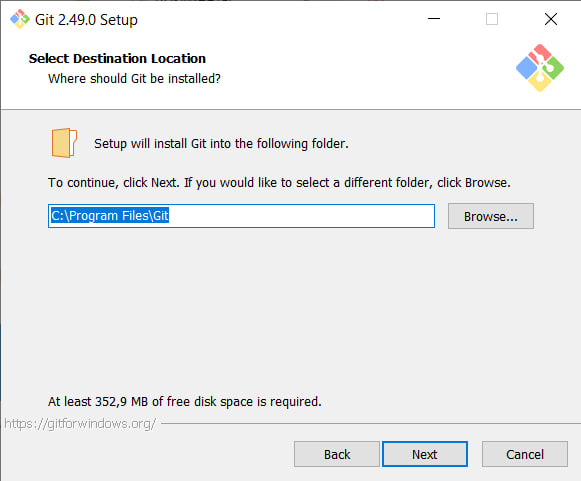

 + Выбор компонентов для установки:
	 + Интеграция в `Windows Explorer` (для появления в Проводнике по ПКМ на соответствующих формату файлах "Открыть в `Git Bash / GUI`");
	 + (опционально, может быть полезно для научной работы или при совместной разработке большого проекта через `Git`) Поддержка `Git Large File Support` - специальный способ хранения и работы с большими файлами, расположенными на удалённом репозитории;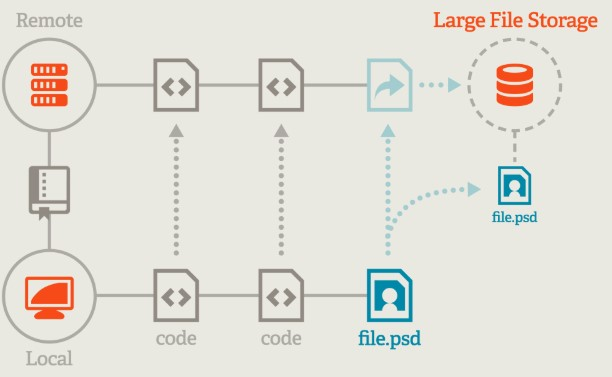
	 + Использование настроек `Git SCM` (текстового редактора по умолчанию и консольного `Shell`-интерпретатора `Git Bash`) для `.git` и `.sh`-файлов соответственно;
	 + Для современных многооконных `Windows`-терминалов добавить поддержку `Git Bash` (для запуска `Git Bash` не в виде отдельного приложения, а в виде одной из вкладок встроенного терминала);
	 + (опционально, может быть полезно для научной работы или при совместной разработке большого проекта через `Git`) `Git Scalar` - инструмент для оптимизированной работы с большими `Git`-проектами;

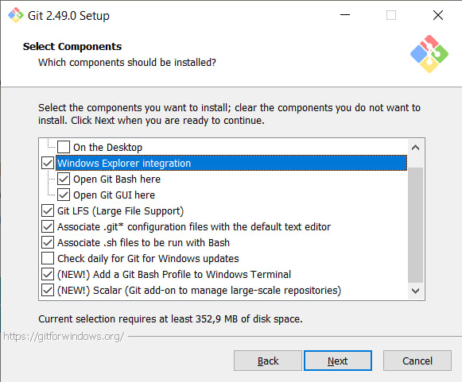

 + Место расположения ярлыков в стартовом меню (не меняем, если нет специальной персональной необходимости в этом):

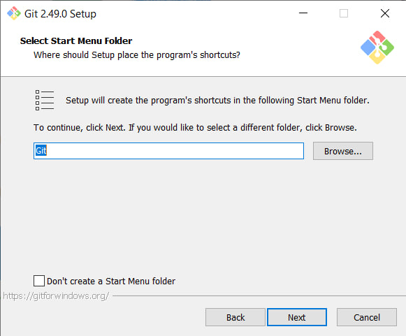

 + Текстовый редактор по умолчанию:

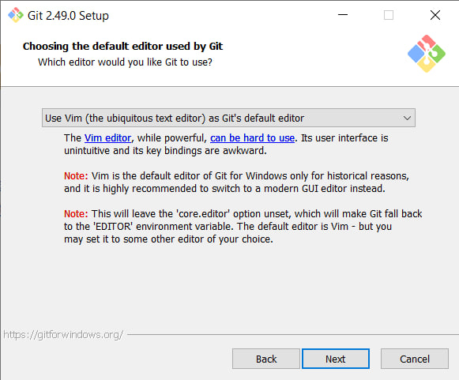

 + Спецификация именования основной ветки разработки для репозиториев (последствием общественных недовольств относительно классического `master` (якобы отсылающим к ущемлениям некоторых народов в мировой истории) стала возможность изменения названия основной ветки разработки) (не меняем, если это не расходится с моральными и этическими принципами):

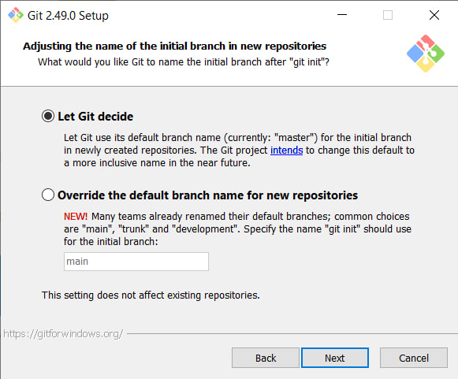

 + Использование глобальной переменной окружения `PATH`:
	 + Не задействовать её в работе, в таком случае только `Git Bash` будет поддерживать команды `Git`;
	 + Добавить путь к командам `Git` в `PATH`, чтобы пользоваться им из любого терминала, а не только из `Git Bash`, однако `Unix`-инструменты будут доступны только из `Git Bash`;
	 + Добавить все пути до `Unix`-инструментов и `Git` в `PATH`; 


Поскольку в рамках курсов планируется всю работу совершать исключительно через `Git Bash`, достаточно даже первого варианта, дальнейшие решения выбираются исходя из потребностей пользователя

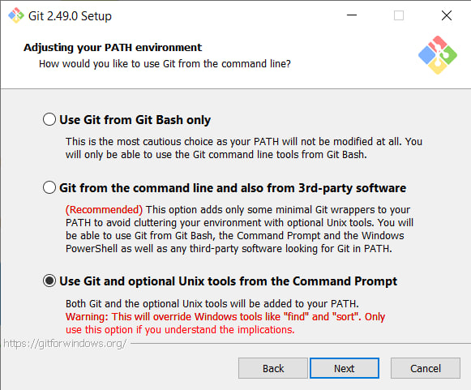

 + Поддержка клиента [Secure Shell](https://habr.com/ru/sandbox/166705/) - однозначно выбираем установку связанного `OpenSSH`:

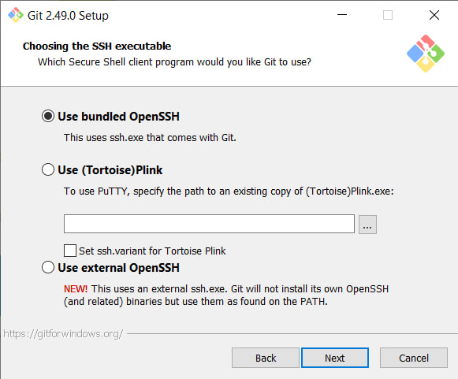

 + Использование криптографических библиотек для протокола `HTTPS` - выбираем поставляемую в комплекте `OpenSSL`:

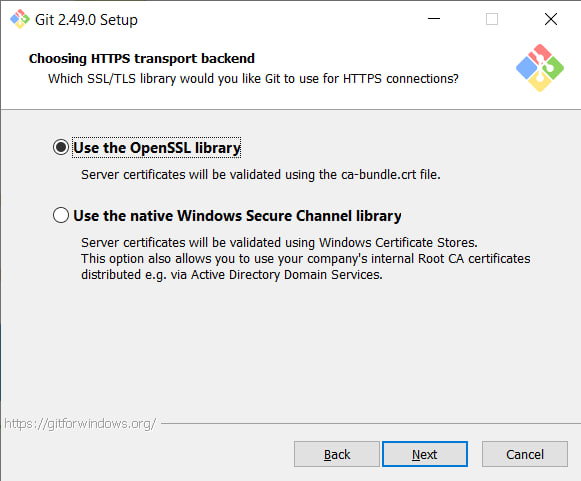

 + Конвертация кодировок конца строк: \
   Отдельная лекция, связанная с кодировками, будет прочитана в процессе курса. Сейчас лишь упомянем, что разные кодировки имеют разный вид окончания конца строки, а поскольку этот символ является ключевым контрольным символом при анализе кода и его интерпретации (особенно в `Python`), нарушение кодировки символа является большой проблемой при работе. \
   Поскольку следующим этапом (после настройки `Git SCM`) будет изменение кодировки системы, типичные для `Windows` окончания строк будут изменены. Тем не менее, нельзя точно гарантировать их полное отсутствие в уже существующих файлах системы. Поэтому выбираем второй пункт: Предварительной проверки нет, для `git`-репозиториев производится трансляция под `Unix`-формат:

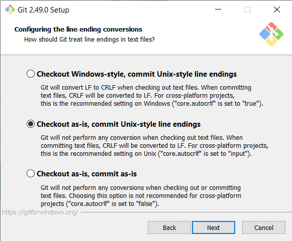

 + Конфигурация эмулятора для `Git Bash`: \
   Для специальных возможностей работы с данными в эмуляторе (непрямоугольное выделение, `Unicode`-отображение символов) предлагается использовать специальный эмулятор `MinTTY`. Однако поскольку смена кодировки системы и так будет проведена, рекомендуется выбрать `Windows`-консоль по умолчанию (заодно не нужно будет изощрёнными способами запускать интерактивный интерпретатор `Python`):

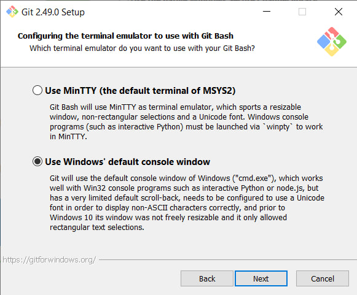

 + Действие по умолчанию для `git pull`: \
   `git pull` - одна из базовых команд `git`, необходимая для получения изменений с удалённого репозитория. В случае, когда со стороны локального репозитория произошли изменения, необходимо уточнить поведение системы контроля версий по совмещению получаемых и текущих изменений:
	 + Классическое поведение `git pull` - `Only Fast-forward`: система контроля версий осуществляет получение изменений с удалённого репозитория только при отсутствии локальных изменений в той же области изменяемых файлов (для изменений из разных источников в `VCS` существует понятие "коллизии" изменений - некоторый коэффициент, описывающий наложение изменяемых областей от разных источников. `Fast-Forward`-алгоритм работает лишь при полном отсутствии коллизии). В иных случаях получения изменений не производится и возвращается информация об ошибке;
	 + Более продвинутое поведение - `Fast-forward + merge`: при наличии изменений с обеих сторон данные с удалённого репозитория принимаются локальным в виде явной (или неявной) параллельной ветки разработки, начиная с последнего общего **коммита** (записанного в `git` изменения; подробнее про команды `git` и связанные с ним термины ниже), после чего производится слияние текущей ветки с полученной (принимающей и, соответственно, основной стороной в слиянии выступает локальная изменённая ветка);
    + Ещё один вариант поведения - `rebase`: при наличии изменений с обеих сторон данные с удалённого репозитория принимаются локальным на позицию с последнего общего коммита, будто локальных изменений не было, после чего производится применение локальных изменений к обновлённой ветке;

Поскольку при совместной разработке основная рабочая версия программы должна храниться на удалённом репозитории, в качестве действия по умолчанию лучше принять `rebase`:

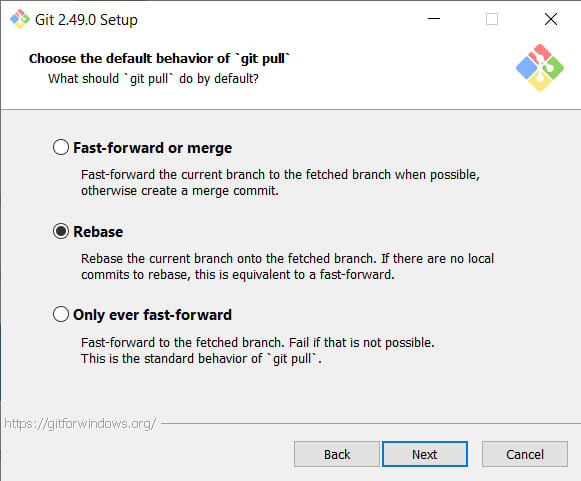

 + Использование специального менеджера `git`-репозиториев (опционально, необязательно):

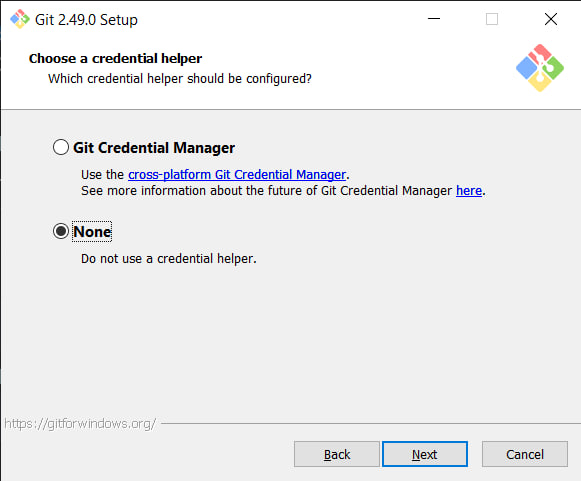

 + Дополнительные опции - поддержка работы с символическими ссылками и ускорение работы за счёт использования кеша:

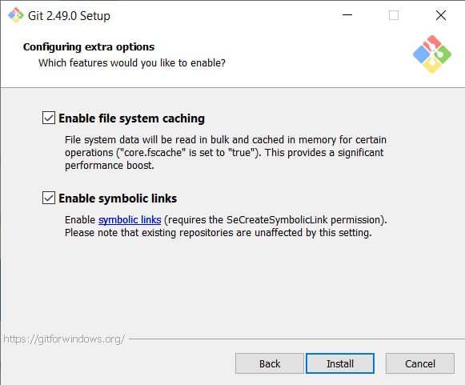

## Смена основной кодировки системы

Для корректной работы `Unix`-утилит и `Python` в особенности (поскольку и с русскими символами будет проводиться работа) необходимо унифицировать кодировку всей системы с кодировкой, в которой будут приходить входные и ожидаться выходные данные - `UTF-8`. Лекция о том, что из себя представляет кодировка, какие кодировки бывают, почему этот вопрос так важен и какие [ОПНАКЕЛШ](https://web.archive.org/web/20120918205702/http://ru.wikipedia.org/wiki/Кракозябры) могут возникнуть при работе, читается в рамках данного курса. При настройке рабочего окружения главной задачей стоит не изучение вопроса, а отсутствие возникающей проблемы в системе. 

Для настройки кодировки необходимо:

 + Открыть меню "Регион" (`Win+R`: `intl.cpl`)

   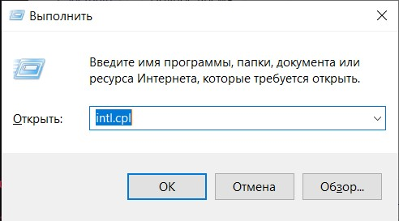

 + Перейти на вкладку "Дополнительно", выбрать пункт "Изменить язык системы"

   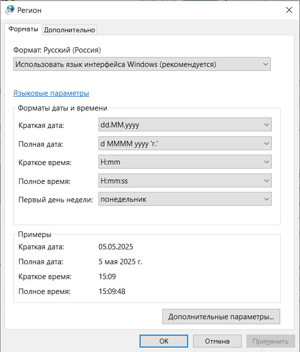

   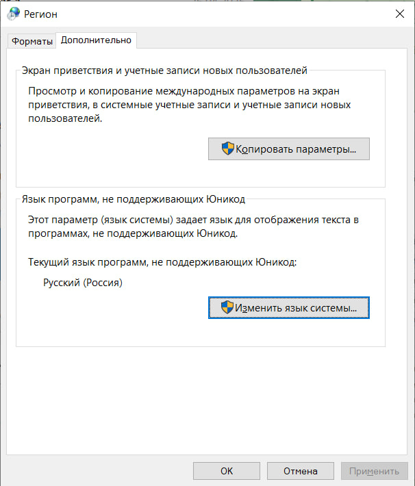

 + Установить галочку на пункте "Бета-версия: Использовать Юникод (UTF-8) для поддержки языка во всем мире", при подтверждении выполнить перезагрузку системы

   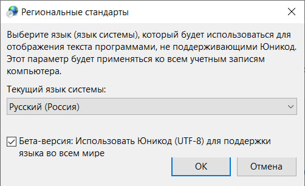

Проверкой параметра выступят выводимые данные утилиты `locale`, а также корректная работа `Python` с русским текстом:

```console
papillon_rouge@LAPTOP-ST8LPKK7 MINGW64 ~/Methodics_Python (master)
$ locale
LANG=ru_RU.UTF-8
LC_CTYPE="ru_RU.UTF-8"
LC_NUMERIC="ru_RU.UTF-8"
LC_TIME="ru_RU.UTF-8"
LC_COLLATE="ru_RU.UTF-8"
LC_MONETARY="ru_RU.UTF-8"
LC_MESSAGES="ru_RU.UTF-8"
LC_ALL=

papillon_rouge@LAPTOP-ST8LPKK7 MINGW64 ~/Methodics_Python (master)
$ py
Python 3.13.2 (tags/v3.13.2:4f8bb39, Feb  4 2025, 15:23:48) [MSC v.1942 64 bit (AMD64)] on win32
Type "help", "copyright", "credits" or "license" for more information.
>>> print("бНОПНЯ")
бНОПНЯ
>>>

papillon_rouge@LAPTOP-ST8LPKK7 MINGW64 ~/Methodics_Python (master)
$
```